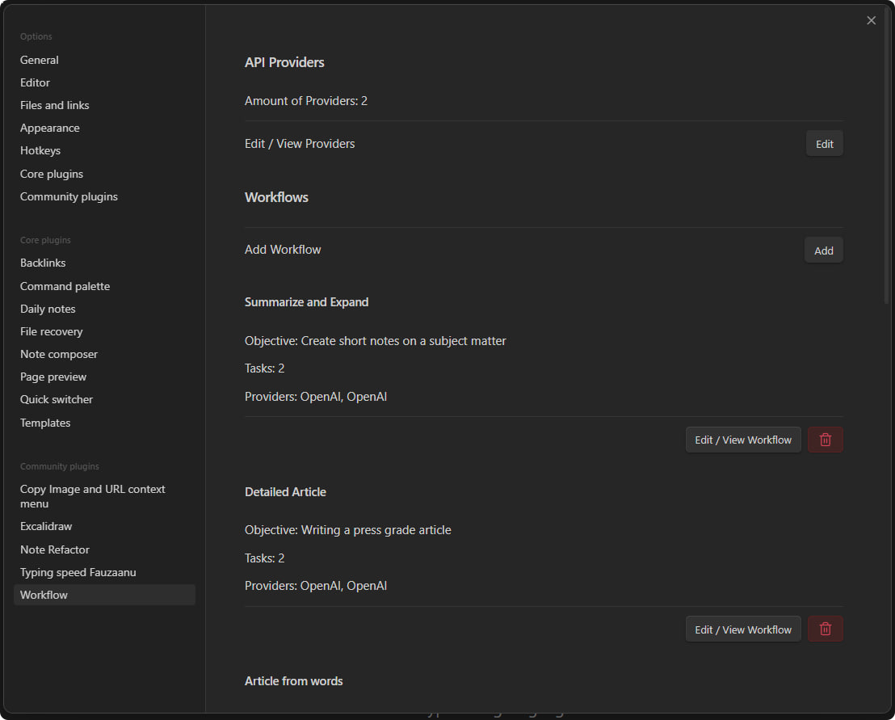
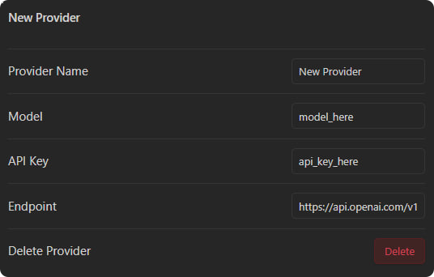
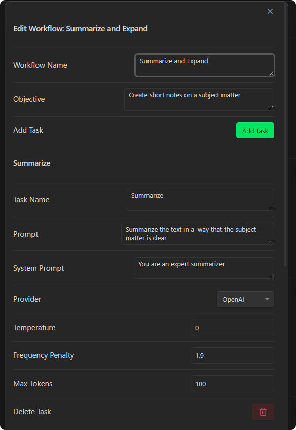
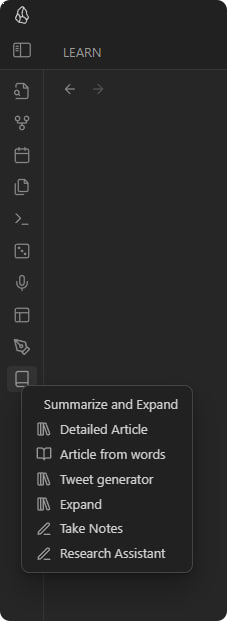
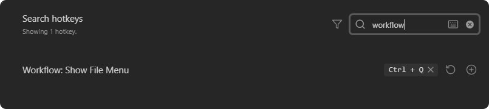
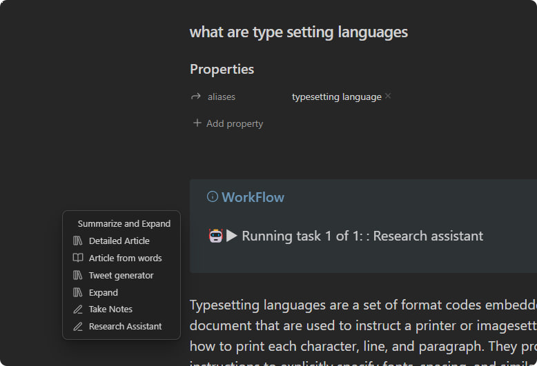

# Workflow Plugin for Obsidian

Workflow is an obsidian plugin that allows you to create and run connected LLM workflows. Each task can be configured to use a different API provider and parameters.

As of now workflow supports OpenAI and Perplexity + any other provider that follow the same schema of OpenAI API

## Settings

Setting tab has two sections:

API PROVIDERS
WORKFLOWS

### API PROVIDERS

This is where you define the api provider with the model a name and the api key

### WORKFLOWS

Workflows include multiple tasks that run one after the other. The workflow is the task group. Each task can be configured to use a different api provider and parameters.

> Perheps you could use an online model from Perplexity to get the information and use gpt-3.5-turbo to summarize or format them.

## Ribbon Icon

The ribbon will show a menu for all your workflows when you click it.

This menu can also be triggered from a shortcut.

This shortcut is not set by default and you can set it from the hotkeys settings.

By setting this shortcut you can trigger the menu from the current cursor position without having to move your mouse to the ribbon.

By [@fauzaanu](https://t.me/fauzaanu)

